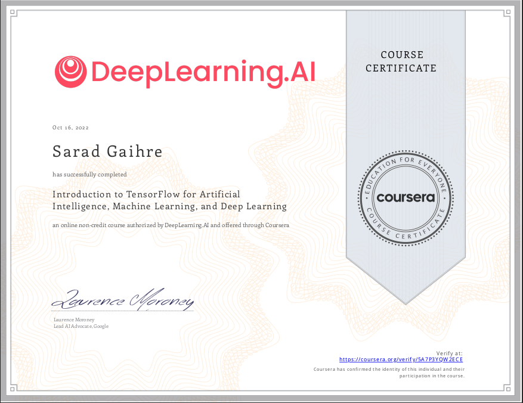

# Hi, I'm `sarad`, a high school student currently in my senior year.📜

`Systems AI Crypto Rustacean-Cnile`

## I'm passionate about coding, designing, and procastinating!

### I'm currently learning 
- Deep Learning and Neural Network (Transformers)🕸️
- Graphics Designing (heads up: I'm ~~terrible~~ *ok* at it) 👨🛠
- Data Structures and Algorithms 💻
- Spanish (B1)🇪🇸
- Systems Programming ❤️

### Goals

- To be proficient in all the things I'm currently learning
- GO by 2023
- ...

# I use

 
 
 

---

# To Learn List
### Last updated: Oct 28, 2022
- Go
- Zig
- Blockchain
- MySQL
- Redis
- PHP
- Kotlin
- Flutter
- French
- German

 

# Socials

[][goodreads]
[][discord]

 
 

---

 

# Formal

 
 

---

## 1 Week Language Use History

 

 

# Certificates

<br4/>

 

---
# Stats

 

[goodreads]: https://www.goodreads.com/user/show/125508043-crox-x
[discord]: https://www.discordapp.com/users/432483076145414145
